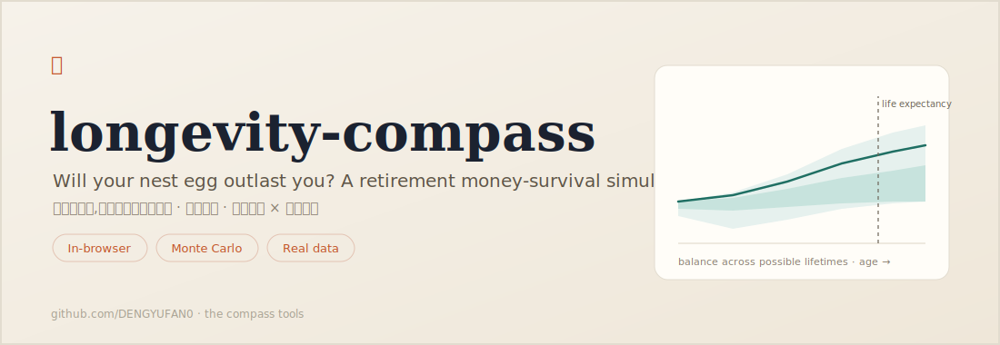

# Longevity Compass · 养老罗盘 ✦



A **retirement money-survival simulator**. Given a nest egg, a spending plan, and an asset mix, it runs a **Monte Carlo** over **real historical returns** and answers the only question that matters in retirement: **will your money outlast you?** It runs entirely in your browser — your numbers never leave your device.

> 一个**退休"钱够不够"模拟器**。给定养老资产、支出计划与股债搭配,用**真实历史收益**做上千次**蒙特卡洛**重演,回答退休阶段最要命的问题:**钱会不会比人先走?** 纯前端运行,数据不出本地。

    

## Why it's different

Most retirement calculators quietly lie to you by using a single average return. This one takes seriously the two risks that actually sink retirements:

- **Sequence-of-returns risk.** At the *same* average return, a bear market in the **first few years** — while you're withdrawing — can permanently sink a portfolio. Your luck at the **start** of retirement matters more than the long-run average. The fan chart makes this visible: a wide band means timing dominates.
- **Longevity risk.** "Plan to life expectancy" is a coin flip — by definition, **half of people live longer**. By default the tool randomizes lifespan with a Gompertz mortality curve, so "success" means your money lasts as long as *you* actually do, not just to the average.

## Features

- 🎲 **Monte Carlo** over real historical returns (block bootstrap preserves sequence realism)
- 📈 **Fan chart** of possible balances by age — the spread *is* the sequence risk
- 📉 **Withdrawal-rate → success curve**, so you can see the cliff before you walk off it
- 🎚️ Three withdrawal strategies: fixed-real, **guardrails** (Guyton–Klinger-style), percent-of-portfolio
- ⚰️ **Longevity modeled** (Gompertz) or plan-to-a-fixed-age
- 🌏 Bilingual (中文 / English), everything in today's money, 100% client-side, zero dependencies

## Try it

- **Hosted:** <https://dengyufan0.github.io/longevity-compass/>
- **Locally:** open `index.html` in a browser. No build, no server.

## How it works

Year by year in retirement: you withdraw at the **start** of the year per your strategy, then the remainder earns **that year's real return** (sampled from history). Repeat over the modeled lifespan; repeat the whole life a thousand+ times. **Success rate** = the share of lives in which you never ran out of money while alive.

- **Real terms.** Returns are inflation-adjusted and spending is constant-real, so every number is today's purchasing power.
- **Strategies.** *Fixed* = constant purchasing power (classic 4%-rule shape, most fragile). *Guardrails* = trim spending when the withdrawal rate drifts high, raise it when low. *Percent* = never hits zero, but income swings with markets.
- **Longevity.** A Gompertz curve (death hazard rises exponentially with age) calibrated to a chosen life expectancy. Real period life tables (SSA / WHO / China) are a documented upgrade.

Background: Bengen (1994) and the *Trinity study* on safe withdrawal rates; Guyton & Klinger (2006) on decision-rule "guardrails"; the sequence-of-returns literature; Gompertz (1825) on the law of mortality.

## Trust the math

The engine (`assets/longevity.js`) is pure, framework-free, and unit-tested — the withdrawal state machine, sequence-risk ordering, the bootstrap, the Gompertz calibration, and Monte Carlo reproducibility are all checked against hand-computed cases.

```bash
node --test          # test/longevity.test.js — no dependencies (Node 18+)
npm run fetch-data   # refresh the bundled real-return history
```

## Data & honest limits

The tool bundles **two** US historical real-return datasets, selectable in the UI. They use **different bond series and cover different windows on purpose** — they are not spliced together into one longer series, since their bond legs aren't comparable instrument-for-instrument:

- **`us1928` (default).** S&P 500 (incl. dividends) vs US 10-year Treasury bond, annual, **1928–2025**. Source: [Aswath Damodaran, NYU Stern](https://pages.stern.nyu.edu/~adamodar/pc/datasets/histretSP.xls) (`histretSP.xls`, "Returns by year" sheet). This is the longer window — it includes the Great Depression, 1970s stagflation, and other harsh sequences the 1989-onward window misses.
- **`us1989`.** ^SP500TR (S&P 500 Total Return) vs VBMFX (Vanguard Total Bond Market), annual, **1989–2025**, deflated by FRED CPIAUCSL. A shorter, favorable window with a more realistic total-bond-market bond leg (vs. a single 10-year Treasury).

Both are **annual real total returns** (inflation-adjusted, dividends reinvested). Whichever you pick, **real-world risk may be higher than shown** for years outside its window. The model also ignores taxes, fees beyond your input, long-term-care shocks, pensions/social security, and single-country risk.

**China / Korea series: deliberately not included yet.** Investigated and shelved — not a "coming soon", but a real data wall:
- Equity indices found are **price indices without dividends** reinvested, which understates real total return.
- Bond-market ETFs with investable history are too short (China ~2013+, Korea ~2009+) to build a meaningful bootstrap window.
- A reliable, directly fetchable CPI source for both countries wasn't found from this network. Waiting for a better data source before adding these.

**Refreshing the data:**

```bash
python scripts/extract_damodaran.py   # re-downloads histretSP.xls, extracts + validates us1928
npm run fetch-data                    # rebuilds assets/data.js from both sources
```

`fetch-data` refreshes `us1989` from Yahoo Finance + FRED live; **FRED is generally unreachable from mainland-China networks** (TLS reset) — run that step from a network where it resolves, or it silently keeps the last-known `us1989` values while `us1928` still refreshes normally.

**It is a planning compass, not an actuary — and not investment or financial advice.**

## Project structure

```
longevity-compass/
├── index.html
├── assets/
│   ├── longevity.js        # pure Monte Carlo engine (browser + Node, UMD)
│   ├── data.js             # bundled real-return datasets (auto-generated, v2: multi-dataset)
│   ├── app.js              # UI, i18n, dataset selector, SVG fan chart + curve, localStorage
│   └── style.css
├── scripts/
│   ├── extract_damodaran.py    # downloads + validates the Damodaran us1928 source data
│   ├── damodaran-annual.json   # extracted us1928 source (committed build material)
│   └── fetch-data.mjs          # assembles assets/data.js from both sources
├── test/
│   ├── longevity.test.js  # node:test unit tests for the engine
│   └── data.test.js       # node:test unit tests for the bundled datasets
└── .github/workflows/      # CI (tests) + auto-deploy to GitHub Pages
```

## Deploy on GitHub Pages

The workflow runs the tests and publishes on every push to `main`. Turn it on once: **Settings → Pages → Source: GitHub Actions**. Live at `https://<you>.github.io/longevity-compass/`.

## License

[MIT](LICENSE) — do anything, no warranty. Not financial advice.
